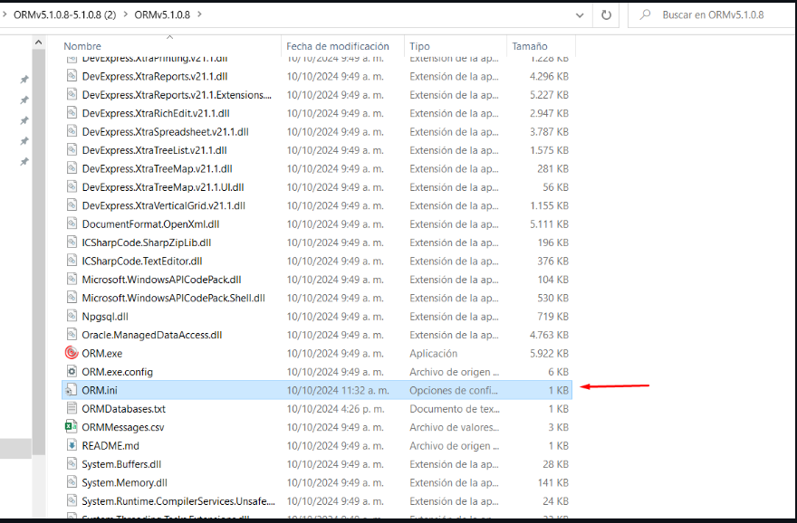

Migración entre dos ambientes.       
--
Pasos para la migración entre ambientes.

1. Se debe realizar un export exclusivamente del esquema ORM. expdp schema = ORM
2. Crear los tablespaces de ORM, los cuales son ORM_DATOS y ORM_INDEX. Para eso se debe aplicar los siguientes scripts.
Se debe tener en cuenta las rutas en donde van a ser creados los datafiles y ser reemplazados por ???? de cada script
```
CREATE TABLESPACE ORM_DATOS DATAFILE 
'?????\ORM_DATOS01.DBF' SIZE 60M AUTOEXTEND ON NEXT 2M MAXSIZE 400M
LOGGING
ONLINE
EXTENT MANAGEMENT LOCAL AUTOALLOCATE
BLOCKSIZE 8K
SEGMENT SPACE MANAGEMENT AUTO;

CREATE TABLESPACE ORM_INDEX DATAFILE 
  '?????\ORM_INDEX01.DBF' SIZE 40M AUTOEXTEND ON NEXT 2M MAXSIZE 200M
LOGGING
ONLINE
EXTENT MANAGEMENT LOCAL AUTOALLOCATE
BLOCKSIZE 8K
SEGMENT SPACE MANAGEMENT AUTO;
```
3. Crear el usuario ORM en el esquema, se puede generar la creación con anterioridad o cuando se realice el import (impdp) del esquema dando continuidad con el paso 1.
4. Se debe aplicar el script 02-Role.sql debido a que solo se migrar el esquema ORM. por lo que es necesario la creación de ORM_USER_ROLE.
```
GRANT ORM_USER_ROLE TO CONNECT_ROLE;
```
5. Se debe validar que la tabla ORM_OPTLIC se encuentre vacia, debido a que posterior al import es necesario licenciar la nueva base de datos.
6. Crear los sinonimos, para este paso es necesario que se recreen los sinonimos públicos, estos sinonimos se encuentre en el script 03-Tablas.sql línea 2306
```
CREATE OR REPLACE PUBLIC SYNONYM OPT_CONSULTA FOR OPT_CONSULTA;
CREATE OR REPLACE PUBLIC SYNONYM OPT_CONSULTAS_ROLE FOR OPT_CONSULTAS_ROLE;
CREATE OR REPLACE PUBLIC SYNONYM OPT_CONSULTA_EJECS FOR OPT_CONSULTA_EJECS;
CREATE OR REPLACE PUBLIC SYNONYM OPT_CONSULTA_PROGS FOR OPT_CONSULTA_PROGS;
CREATE OR REPLACE PUBLIC SYNONYM OPT_CONSULTA_PROGS_DET FOR OPT_CONSULTA_PROGS_DET;
CREATE OR REPLACE PUBLIC SYNONYM OPT_CONSULTA_PROGS_PARAMS FOR OPT_CONSULTA_PROGS_PARAMS;
CREATE OR REPLACE PUBLIC SYNONYM OPT_CONSULTA_RESTRICT FOR OPT_CONSULTA_RESTRICT;
CREATE OR REPLACE PUBLIC SYNONYM OPT_HISTORIAL FOR OPT_HISTORIAL;
CREATE OR REPLACE PUBLIC SYNONYM OPT_HIST_CONSULTA FOR OPT_HIST_CONSULTA;
CREATE OR REPLACE PUBLIC SYNONYM OPT_LAYOUT FOR OPT_LAYOUT;
CREATE OR REPLACE PUBLIC SYNONYM OPT_PAGESETTINGS FOR OPT_PAGESETTINGS;
CREATE OR REPLACE PUBLIC SYNONYM OPT_PARAMETROS FOR OPT_PARAMETROS;
CREATE OR REPLACE PUBLIC SYNONYM OPT_PIVOT FOR OPT_PIVOT;
CREATE OR REPLACE PUBLIC SYNONYM OPT_ROLES_USUARIO FOR OPT_ROLES_USUARIO;
```
7. Validar  el tipo de autenticación que se utiliza en esa instalación (parámetro del ORM.ini): si es tipo 1, 



El DBA debera migrar cada uno de los usuarios creados en la bd origen que acceden a ORM y recrearlos en la nueva bd. Si el tipo de autenticación es 2 no hay problema, solo se ingresa a la bd con usuario ORM según se defina en el ORM.ini. (Se debe tener en cuenta que los usuarios tipo 1 son usuarios de base de datos y los usuarios tipos 2 son creados por el aplicativo.)

8. Ejecutar el script 08-ValidaciónElementos.sql con el fin de verificar que todos los objetos se cargaron correctamente en el import, debera dar como resultado lo descrito en la siguiente imagen:


```
select object_type ELEMENTO, count(*) CANTIDAD
from user_objects
group by object_type
UNION
select 'CONSTRAINT ' || DECODE(constraint_type, 'R', 'REFERENTIAL', 'P', 'PRIMARY', 'C', 'CHECK', constraint_type) ELEMENTO, count(*) CANTIDAD
from user_constraints
group by constraint_type
UNION
SELECT  'OBJETOS INVALIDOS' ELEMENTO, count(*) CANTIDAD
         FROM user_objects a
        WHERE status = 'INVALID'
          AND object_type IN
                 ('PACKAGE BODY', 'PACKAGE', 'FUNCTION', 'PROCEDURE',
                  'TRIGGER', 'VIEW')
order by 1
```
---

**Nota:** Para más información sobre la instalación el siguiente repositorio se encuentra la guía paso a paso. **https://github.com/JoseDaniel06/installORMv5.1.0.8.git**
